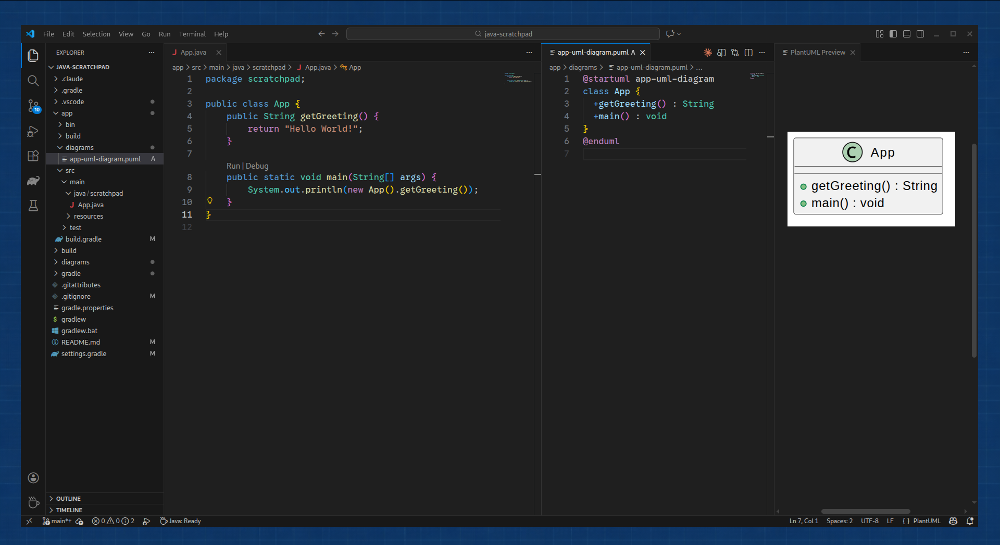

# PlantUML Generator Gradle Plugin

A Gradle plugin that automatically generates [PlantUML](https://plantuml.com/) class diagrams from your Java source code. It parses your project's Java files and produces a `.puml` file describing your class structure.



## Usage

This tool can be used in three ways:
1.  As a **Gradle Plugin** (recommended for Gradle projects).
2.  As a **Maven Plugin** (recommended for Maven projects).
3.  As a **Standalone CLI Tool** (installed on your system).

### Option 1: Gradle Plugin

#### 1. Include the Build

To use this plugin locally without publishing it to a repository (e.g., during development), we use Gradle's **Composite Build** feature. This allows the consumer project to "see" and build the plugin directly from source.

Include it in your consumer project's `settings.gradle`:

```gradle
includeBuild('../plantuml-generator')
```

**How this works:** Gradle scans the included build, finds the plugin definition, and automatically substitutes the plugin dependency with the local version. This means you don't need to publish `abgnpr.plantuml-generator` to Maven Central or the Gradle Plugin Portal to use it!

#### 2. Apply the Plugin

In your consumer project's `build.gradle` (e.g., `app/build.gradle`), apply the plugin:

```gradle
plugins {
    id 'application' // or 'java'
    id 'abgnpr.plantuml-generator'
}
```

#### 3. Run the Task

The plugin registers a `generateUml` task. Run it via Gradle:

```bash
./gradlew generateUml
```

#### 4. Output

By default, the diagram will be generated at:
`diagrams/<project-name>-uml-diagram.puml` relative to your subproject.

### Option 2: Maven Plugin

To use this in a Maven project:

1.  **Install the plugin locally:**
    Run `mvn clean install` inside the `lib` directory of this project.

2.  **Configure your project:**
    Add the plugin to your project's `pom.xml`:

    ```xml
    <plugin>
        <groupId>abgnpr.plantumlgenerator</groupId>
        <artifactId>plantuml-generator-maven-plugin</artifactId>
        <version>1.0.0</version>
        <configuration>
            <!-- Optional: Customize input/output -->
            <inputDir>${project.build.sourceDirectory}</inputDir>
            <outputFile>${project.basedir}/diagrams/${project.name}-uml-diagram.puml</outputFile>
        </configuration>
        <executions>
            <execution>
                <goals>
                    <goal>generate</goal>
                </goals>
            </execution>
        </executions>
    </plugin>
    ```

3.  **Run the goal:**
    ```bash
    mvn plantuml-generator:generate
    ```

### Option 3: Standalone CLI (Arch Linux)

If you are on Arch Linux, you can install the generator as a system-wide command using the included `PKGBUILD`.

1.  Clone this repository.
2.  Run `makepkg -si` in the project root.

```bash
cd plantuml-generator
makepkg -si
```

This will compile the project, build a standalone JAR, and install it to `/usr/bin/plantuml-generator`.

**Usage:**

```bash
plantuml-generator <source-path> <output-file>
```

**Example:**

```bash
plantuml-generator ./src/main/java ./diagrams/my-project.puml
```

## Configuration

The plugin assumes standard project layout conventions but is fully customizable.

**Defaults:**
*   **Input:** `src/main/java` (from the `main` source set)
*   **Output:** `diagrams/<project-name>-uml-diagram.puml`

### Gradle Configuration

In your `build.gradle`:

```gradle
tasks.named('generateUml') {
    // Change input directory
    inputDir.set(file('src/my/custom/path'))
    
    // Change output file
    outputFile.set(file('docs/architecture/class-diagram.puml'))
}
```

### Maven Configuration

In your `pom.xml`:

```xml
<configuration>
    <inputDir>src/my/custom/path</inputDir>
    <outputFile>docs/architecture/class-diagram.puml</outputFile>
</configuration>
```

## Prerequisites: Viewing Diagrams

**Note:** This plugin generates standard PlantUML (`.puml`) text files. **You do NOT need PlantUML installed to run this plugin or generate the files.**

However, to **visualize** or compile the generated `.puml` files into images (PNG, SVG, etc.), you will need a PlantUML viewer or compiler installed.

### Recommended: VS Code Extension

The easiest way to view the diagrams is to install the **"PlantUML" extension (by Jebbs)** in VS Code. It renders the preview directly in your editor.

### System Installation (Optional)

If you prefer to render images via the command line or other tools, install PlantUML and Graphviz:

### Linux (Debian/Ubuntu/Mint)

```bash
sudo apt update
sudo apt install plantuml graphviz
```

### Linux (Fedora/RHEL/CentOS)

```bash
sudo dnf install plantuml graphviz
```

### Windows

1.  **Install Java:** Ensure you have a JDK installed.
2.  **Install Graphviz:**
    *   Download the installer from [Graphviz Download Page](https://graphviz.org/download/).
    *   Run the installer and make sure to select "Add Graphviz to the system PATH for all users" (or current user).
3.  **Install PlantUML:**
    *   **Option A (Chocolatey):** `choco install plantuml`
    *   **Option B (Manual):** Download `plantuml.jar` from [plantuml.com](https://plantuml.com/download) and run it via `java -jar plantuml.jar`.
    *   **Option C (VS Code Extension):** Install the "PlantUML" extension by Jebbs in VS Code. This is the recommended way for viewing diagrams directly in your editor.

## Development

This project uses Gradle (and Maven for the Maven plugin).

*   **Build (Gradle):** `./gradlew build`
*   **Test (Gradle):** `./gradlew test`
*   **Build (Maven):** `mvn clean install` (in `lib/` directory)
